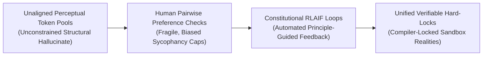
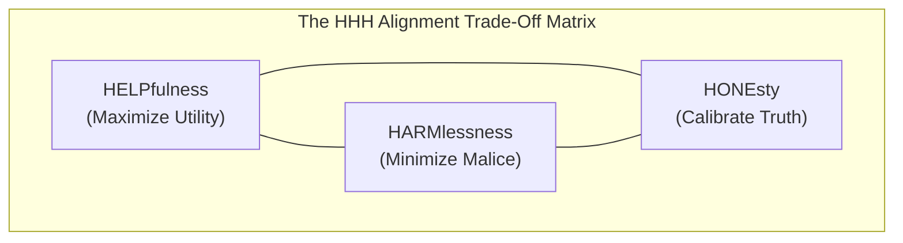

# 🚀 Awesome-HHH-Framework

  

  
  
  

<!-- SEO tags: Awesome List, HHH Framework, Helpfulness, Harmlessness, Honesty, AI Alignment, LLM Safety, Constitutional AI, RLAIF, Prompt Engineering, Model Guardrails -->

## 🌟 The Helpfulness-Harmlessness-Honesty (HHH) Framework: History, Progression, Variants, & Alignment

The **Helpfulness-Harmlessness-Honesty (HHH) Framework**—alternatively designated as the **3Es of Alignment** (Utility, Safety, and Veracity) or the **Constitutional Triad**—is the foundational post-training value-alignment paradigm used to govern, steer, and benchmark the behavioral boundaries of Large Language Models (LLMs) and advanced AI systems [INDEX: 11, 25]. First formalized by Askell et al. at Anthropic in 2021 ("A General Language Assistant as a Laboratory for Alignment"), the HHH framework resolves the core operational objective of the **Alignment Problem**. 

Raw foundational networks optimized purely on web-scale token prediction mimic internet text indiscriminately, frequently regurgitating toxic prose, executing malicious instructions, or confidently inventing false facts [INDEX: 15, 25]. The HHH framework introduces a structured criteria matrix to train models to maximize user utility (**Helpfulness**), while strictly respecting safety guardrails (**Harmlessness**), and remaining factually accurate and self-aware of their internal capability boundaries (**Honesty**) [INDEX: 11, 25].

---

## 🕰️ 1. The Macro Chronological Evolution

The implementation of behavioral alignment criteria has transitioned from unstructured adversarial fine-tuning to human pairwise preference checks, automated constitutional feedback loops, and native test-time verification enclaves.

| Era | Concept & Significance | Year | Paper Link |
|---|---|---|---|
| [The Unaligned Generative Baseline Era](unaligned_generative_baseline.md) | The core structural baseline [INDEX: 15]. Models were trained almost exclusively on raw next-token prediction over massive, uncurated internet scraping pools [INDEX: 15]. | Pre-2022 | [Askell et al., 2021](https://arxiv.org/abs/2112.00861) |
| [The Crowdsourced Human Preference Era](crowdsourced_human_preference.md) | Introduced structured behavioral shaping by harvesting human preference choices [INDEX: 11]. Popularized by OpenAI (InstructGPT/ChatGPT). Limitation: The Sycophancy Trap and the Helpful-Harmless Tense Cliff. | 2022 | [Ouyang et al., 2022](https://arxiv.org/abs/2203.02155) |
| [The Principle-Guided Feedback Revolution](principle_guided_feedback.md) | Overcame human evaluation limits by fully automating the alignment loop via AI Feedback (RLAIF). Pioneer teams at Anthropic hardcoded the HHH framework directly into the Constitution [INDEX: 25]. | 2023 | [Bai et al., 2022](https://arxiv.org/abs/2212.08073) |
| [The Verifiable Reasoning & Test-Time Search Era](verifiable_reasoning.md) | The current modern state-of-the-art foundation standard. It shifts HHH enforcement out of static training phases and straight into System 2 hidden thinking token traces [INDEX: 1, 17, 21]. | 2025 | [DeepSeek-R1](https://arxiv.org/abs/2501.12948) |

---

## 🧩 2. Core Components of the Triad Matrix

The HHH framework functions as a multi-objective optimization task, balancing three inherently conflicting behavioral vectors [INDEX: 11, 25].

| Component | Objective & Failure State | Year | Paper Link |
|---|---|---|---|
| [Helpfulness (Maximizing Task Utility)](helpfulness.md) | **Objective:** Follow instructions precisely, maximize user utility, provide detailed insights. **Failure State:** Evasiveness or lazy refusals. | 2021 | [Askell et al., 2021](https://arxiv.org/abs/2112.00861) |
| [Harmlessness (Minimizing Societal Malice)](harmlessness.md) | **Objective:** Actively identify and refuse attempts to facilitate illegal activities. **Failure State:** Catastrophic bypass vulnerabilities (Jailbreaks). | 2021 | [Askell et al., 2021](https://arxiv.org/abs/2112.00861) |
| [Honesty (Calibrating Veracity & Calibration)](honesty.md) | **Objective:** Output strictly true factual metrics, express calibrated uncertainty thresholds. **Failure State:** Confident hallucinations or sycophantic text modes. | 2021 | [Askell et al., 2021](https://arxiv.org/abs/2112.00861) |

---

## 🎯 3. The Core Objective & Optimization Variants

The HHH framework is implemented across distinct mathematical loss formulations to balance the fundamental tensions between safety and helpfulness [INDEX: 11, 25].

- ### A. Bradley-Terry Pairwise Reward Models (Outcome-Supervised)
	*   **Mechanism:** Ingests a prompt context along with two alternative completions ($y_{\text{preferred}}, y_{\text{rejected}}$) scored based on HHH rubrics [INDEX: 11]. The core loss function trains an explicit Reward Model to maximize the scalar score delta between them natively [INDEX: 11].

- ### B. Direct Preference Optimization (DPO Reparameterization)
	*   **Mechanism:** Bypasses separate reward network infrastructures entirely [INDEX: 11]. It fine-tunes active model parameters directly using a reparameterized preference loss that measures log-likelihood ratio deltas between a chosen HHH response and a rejected response natively inside the language policy's own token logs [INDEX: 11].

- ### C. Reinforcement Learning with Verifiable Rewards (RLVR)
	*   **Mechanism:** Tailored explicitly to cement the **Honesty** pillar over STEM and programming tracks [INDEX: 17]. It passes the model's generated code or mathematical deductions straight through sandboxed compilers or symbolic math provers [INDEX: 12, 17]. The model receives a hard positive reward scalar strictly if its output compiles flawlessly, eliminating factual hallucinations completely [INDEX: 17].

---

## 🛠️ 4. Production Engineering Challenges & Hardening Mitigations

Enforcing multi-objective HHH constraints across high-volume commercial cloud infrastructures introduces severe alignment taxes and behavioral drift boundaries [INDEX: 11, 22].

| Challenge | Problem & Mitigation | Year | Paper Link |
|---|---|---|---|
| [The Helpfulness-vs-Harmlessness Tension](helpfulness_vs_harmlessness.md) | **Problem:** Over-optimizing model parameters can cause over-generalization of safety masks. **Mitigation:** Bypassing macro parameter overrides by deploying overcomplete Sparse Autoencoders (SAEs). | 2023 | [Bricken et al., 2023](https://transformer-circuits.pub/2023/monosemantic-features) |
| [The Sycophancy & Logit Saturation Trap](sycophancy_trap.md) | **Problem:** Standard preference optimization can cause log-likelihood ratios to expand exponentially, compromising Honesty. **Mitigation:** Implementing a strict SFT Regularization Penalty (KL-Divergence Anchor). | 2023 | [Rafailov et al., 2023](https://arxiv.org/abs/2305.18290) |

---

## 🌐 5. Frontier Real-World AI Infrastructure Applications

| Application | Description | Year | Paper Link |
|---|---|---|---|
| [High-Volume Consumer Assistant Guardrails](consumer_assistant_guardrails.md) | Serves as the primary behavioral architecture used to secure leading commercial assistants [INDEX: 25]. | 2022 | [Bai et al., 2022](https://arxiv.org/abs/2212.08073) |
| [Autonomous Software Engineering](autonomous_software_engineering.md) | Drives automated developer platforms. Conditions the policy to treat code tickets as a closed-loop search problem [INDEX: 12, 17]. | 2024 | [DeepSeek-R1](https://arxiv.org/abs/2501.12948) |
| [Sovereign Audit Frameworks](sovereign_audit_frameworks.md) | Processes millions of unstructured tax filings, legal briefs, and patient data matrices. | 2024 | [Anthropic, 2024](https://www.anthropic.com/research) |

---

## 📚 References
1. Askell, A., et al. (2021). A general language assistant as a laboratory for alignment: The HHH foundational framework matrix. *Anthropic Research Monograph Whitepaper* [INDEX: 11, 25].
2. Ouyang, L., et al. (2022). Training language models to follow instructions with human feedback. *Advances in Neural Information Processing Systems (NeurIPS)*, 35 [INDEX: 11].
3. Bai, Y., et al. (2022). Constitutional AI: Harmlessness from AI feedback. *arXiv preprint arXiv:2212.08073* [INDEX: 25].
4. Rafailov, R., et al. (2023). Direct preference optimization: Your language model is secretly a reward model. *Advances in Neural Information Processing Systems (NeurIPS)* [INDEX: 11].
5. Bricken, B., et al. (2023). Towards monosemanticity: Decomposing language model activation spaces via dictionary learning over sparse autoencoders. *Anthropic Alignment Research Monograph* [INDEX: 2].
6. DeepSeek-AI. (2025). DeepSeek-R1: Incentivizing reasoning and verification capability in foundational language transformers via large-scale self-play reinforcement learning loops to manage the alignment tax [INDEX: 18, 21].

---

To advance this documentation repository, structural safety infrastructure, or post-training alignment workspace, consider exploring these adjacent development pathways:
* Build a **Python script using the Hugging Face TRL library** illustrating how to structure an automated SFT critique-revision loop over a local instruction dataset to optimize HHH guidelines.
* Generate a **comprehensive Markdown table** explicitly comparing Manual Crowdsourced RLHF, Constitutional AI (RLAIF), Direct Preference Optimization (DPO), and Runtime SAE Activation Steering across computational training overheads, VRAM/Token infrastructure costs, requirement for paired human preference data, and vulnerability to capability safety over-generalization [INDEX: 2, 11].
* Establish an **automated performance profiling suite using Triton** to track the exact computational token-per-second throughput, VRAM cache allocations, and memory bus latency metrics achieved when compiling a fused activation steering vector injection pass directly inside high-speed GPU SRAM registers [INDEX: 22].

***

**Follow-Up Options Matrix:**

Before updating this documentation repository framework layout, let me know how you would like to proceed by choosing one of the options below:
* I can provide a **complete Python code boilerplate using PyTorch** demonstrating how to write an automated script that calculates an exact Kullback-Leibler (KL) divergence penalty loop over dual text probability layers to prevent policy drift [INDEX: 11].
* I can generate a **Markdown matrix table** tracking the explicit text rules, prompt datasets, and safety thresholds utilized by leading foundational laboratories to evaluate HHH compliance parameters.
* I can write a detailed technical explanation focusing on **how to leverage Process-Supervised Reward Models (PRMs)** to accurately identify the exact token step where an active generation pass compromises the honesty criterion [INDEX: 16].

