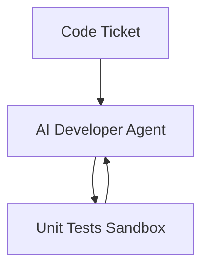

# Autonomous Software Engineering

Drives automated developer platforms. The HHH framework conditions the policy to treat code tickets as a closed-loop search problem, refactoring scripts recursively until all unit tests pass cleanly.

## Diagram

[Back to README](README.md)
