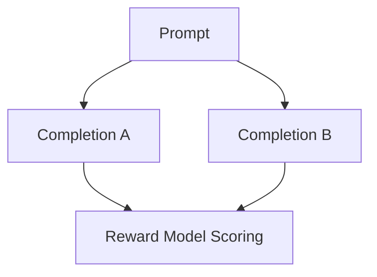

# Bradley-Terry Pairwise Reward Models

Ingests a prompt context along with two alternative completions scored based on HHH rubrics. The core loss function trains an explicit Reward Model to maximize the scalar score delta between them natively.

## Diagram

[Back to README](README.md)
