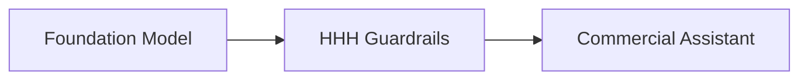

# High-Volume Consumer Assistant Guardrails

Serves as the primary behavioral architecture used to secure leading commercial assistants. Constitutional HHH frameworks fine-tune base models to follow complex international compliance laws cleanly.

## Diagram

[Back to README](README.md)
