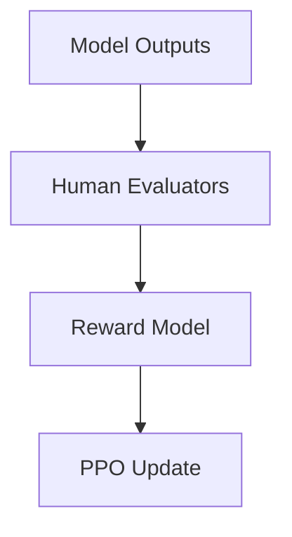

# The Crowdsourced Human Preference Era

Introduced structured behavioral shaping by harvesting human preference choices. Popularized by OpenAI, crowd-sourcers read parallel model outputs, tagging completions based on subjective human utility scales. A reward model learned to predict these preferences, updating the policy via PPO.

## Diagram

[Back to README](README.md)
