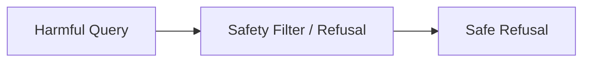

# Harmlessness

The model must actively identify and refuse attempts to facilitate illegal activities, synthesize hazardous biological materials, deploy weaponized source code scripts, or generate targeted hate speech.

## Diagram

[Back to README](README.md)
