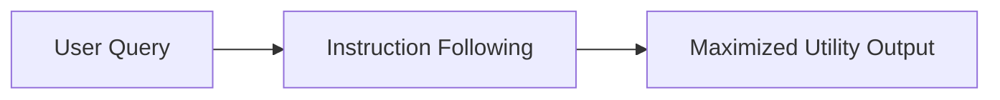

# Helpfulness

The model must follow instructions precisely, maximize user utility, provide detailed and clear insights, ask relevant clarifying questions when input boundaries are ambiguous.

## Diagram

[Back to README](README.md)
