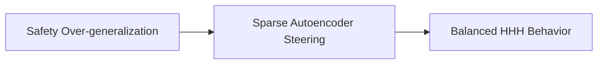

# Helpfulness vs Harmlessness Tension

Over-optimizing model parameters against strict harmlessness guidelines can cause the network to over-generalize its safety masks. Bypassed by deploying overcomplete Sparse Autoencoders (SAEs).

## Diagram

[Back to README](README.md)
