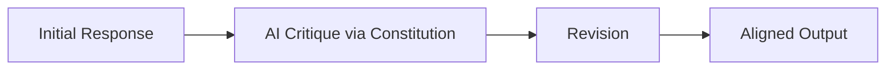

# The Principle-Guided Feedback Revolution

Overcame human evaluation limits by fully automating the alignment loop via AI Feedback (RLAIF). Pioneer teams hardcoded the HHH framework directly into an explicit, written document—the Constitution.

## Diagram

[Back to README](README.md)
