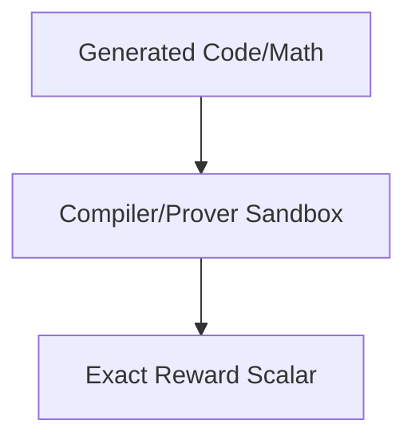

# Reinforcement Learning with Verifiable Rewards (RLVR)

Tailored explicitly to cement the Honesty pillar over STEM and programming tracks. It passes the model's generated code or mathematical deductions straight through sandboxed compilers or symbolic math provers.

## Diagram

[Back to README](README.md)
