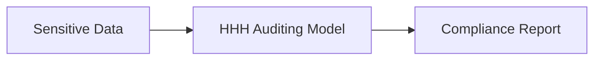

# Sovereign Audit Frameworks

Processes millions of unstructured tax filings, legal briefs, and patient data matrices. High-capacity reasoning foundation models are trained under specialized HHH parameters, forcing the transformer to audit data layers.

## Diagram

[Back to README](README.md)
