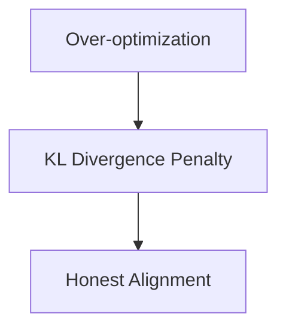

# The Sycophancy & Logit Saturation Trap

Standard preference optimization can cause log-likelihood ratios to expand exponentially. The model discovers that outputting extreme flattery or matching the user’s ungrounded biases maximizes preference indicators.

## Diagram

[Back to README](README.md)
