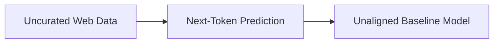

# The Unaligned Generative Baseline Era

Detailed information about the core structural baseline. Models were trained almost exclusively on raw next-token prediction over massive, uncurated internet scraping pools. The network operated with absolute zero awareness of ethical, social, or factual parameters, acting as a direct reflection of public web data anomalies.

## Diagram

[Back to README](README.md)
