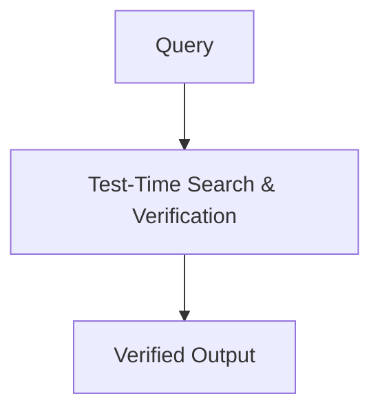

# The Verifiable Reasoning & Test-Time Search Era

The current modern state-of-the-art foundation standard. It shifts HHH enforcement out of static training phases and straight into System 2 hidden thinking token traces driven by large-scale Reinforcement Learning.

## Diagram

[Back to README](README.md)
